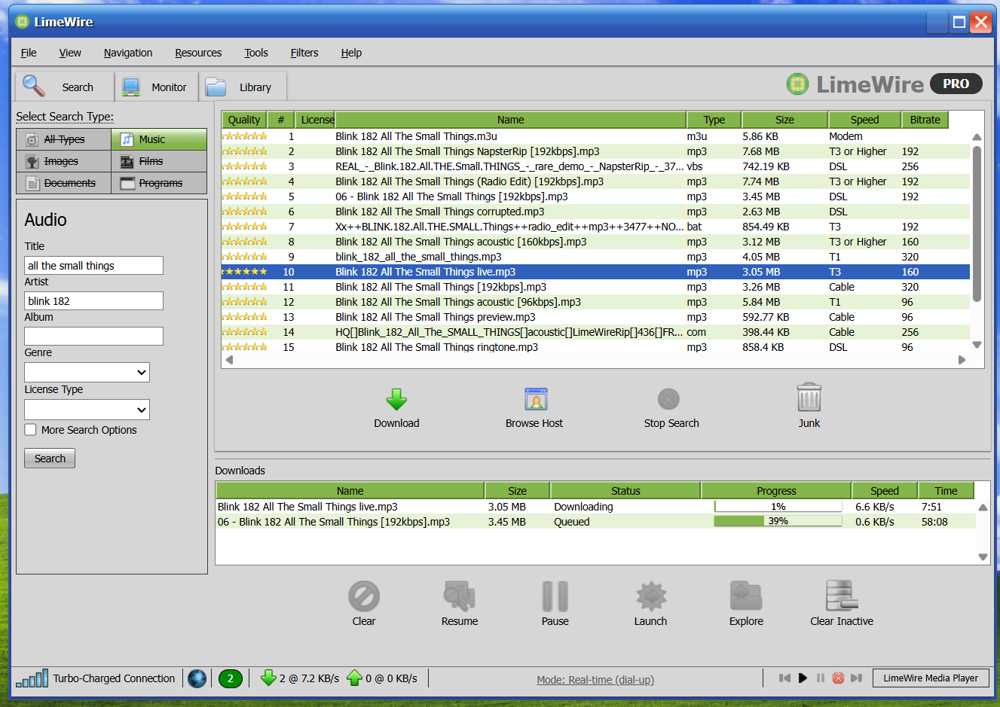

# LimeWire Simulator




A local, self-contained LimeWire-style search and download simulator. It recreates the feel of an early-2000s peer-to-peer client: suspicious search results, unreliable modem-era transfer speeds, bad file hygiene, legal scare screens, seeding guilt, and the occasional fake Windows disaster.

Credit note: this project is a fan recreation inspired by the original LimeWire game that appeared in 2023. It was reconstructed from archived materials and is not affiliated with LimeWire LLC.

The app does not contact LimeWire, Wayback, peers, or any external backend while running. Downloads are UI simulations only.

## Run

```powershell
node server.js
```

Open:

```text
http://localhost:3000/
```

For small displays, compact mode is automatic. You can also force it with:

```text
http://localhost:3000/?compact
```

## What To Try

Search for a song or artist, select a result, and click **Download**. Searches generate a mix of plausible music files, junk files, tiny previews, fake archives, and executable files disguised as music.

Some useful searches:

- `spoonman`
- `numb`
- `bring me to life`
- `metallica one`
- any random song title

## Easter Eggs And Gimmicks

- **Default 100x dial-up acceleration**: by default the simulator speeds up transfers 100x so downloads complete quickly; click the footer `Mode: 100x (accelerated)` link to switch to real-time (slow, dial-up) speeds for an authentic painfully-slow experience.
- **56k modem math**: file sizes are converted into real estimated download times over a 56k line.
- **Shared bandwidth**: multiple active downloads split the same simulated 56k connection instead of each getting its own full speed.
- **Frustrating speed swings**: downloads randomly fluctuate, dip, queue, reconnect, or show `Need More Sources`.
- **Slow search population**: results appear gradually instead of all at once, like an old client finding hosts.
- **Bitrate bait**: some titles include `[128kbps]`, `[192kbps]`, `[320kbps]`, and similar labels.
- **Suspicious result types**: searches include junk like lyrics files, cover art, playlists, corrupt MP3s, archives, and disguised executables.
- **Virus payoff waits for completion**: virus mode triggers only after the bad download reaches 100%.
- **Blue screen on virus**: completing a malware-like result shows a fake Windows BSOD.
- **Idle blue screen**: leaving the app alone for roughly 5 to 8 minutes can trigger a generic BSOD.
- **Legal scare screens**: starting too many downloads can trigger either an FBI-style warning or ISP-style cease-and-desist notice.
- **Random legal threshold**: the scare screen can happen after a random limit from 3 to 10 active downloads.
- **Post-download seeding**: clean completed downloads start seeding at slow, uneven upload rates.
- **Right-click to stop seeding**: right-click a seeding row in the Downloads area to stop it.
- **LEECHER shame**: after stopping seeding 3 times, a big `LEECHER!!!!!!!` message scrolls across the screen once.
- **Upload footer**: the footer tracks active seeds and their current upload rate.
- **Compact-window survival**: the LimeWire window stays accessible on small browser windows instead of disappearing.
- **Era-appropriate chrome**: tabs, toolbar buttons, footer icons, legal notices, and the logo use local image assets from `public/img`.

## Project Layout

- `server.js` - dependency-free local HTTP server and mock API endpoints.
- `public/index.html` - the simulator shell.
- `public/css/style.game.css` - recovered base LimeWire Game stylesheet, patched for the local simulator.
- `public/css/local.css` - local layout fixes, compact mode, icon overrides, legal notice styling, BSOD styling, and extra simulator effects.
- `public/js/client.js` - main browser behavior for search, download simulation, shared 56k bandwidth, seeding, and scoring hooks.
- `public/js/simulator.js` - local setup helpers, compact-screen detection, and search form behavior.
- `public/js/simulator-after.js` - post-load behavior for BSODs and legal warning overlays.
- `public/img/` - runtime image assets used by the interface.

## Notes

This is a nostalgia simulator, not a downloader. It does not fetch files, connect to peers, install anything, or call remote services. All “downloads,” warnings, infections, legal notices, and transfer speeds are simulated in the browser.
